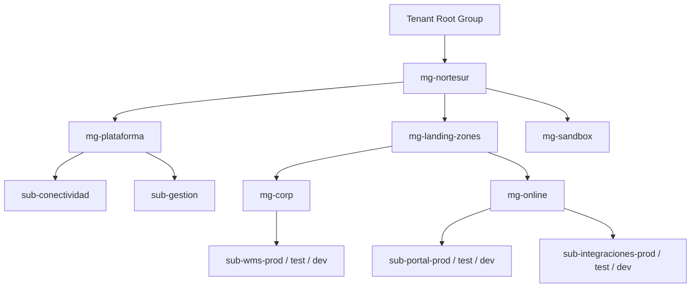

# Arquitectura Cloud Avanzada

> Módulo: Avanzado · Curso 3 de 12 · Duración estimada: 30-40 horas · Estado: ✅ Completo

## Objetivo

Hasta ahora has desplegado cosas: una VM, una app en contenedores, un clúster, un chart. Todo dentro de una suscripción, en un grupo de recursos, para ti. Una empresa real tiene decenas de suscripciones, varios equipos que no deben pisarse, auditores que preguntan dónde están los datos, un presupuesto que alguien tiene que defender y un director que quiere saber qué pasa si se cae una región. Arquitectura Cloud es la disciplina de tomar esas decisiones **antes** de crear el primer recurso, escribirlas para que se puedan discutir y revisar, y organizar la plataforma para que cientos de recursos sigan siendo gobernables dentro de tres años.

En este curso aprenderás el vocabulario y las herramientas con las que Microsoft y la industria organizan una plataforma Cloud empresarial: el Cloud Adoption Framework y las Azure Landing Zones (management groups, suscripciones, gobernanza con Azure Policy, topología hub-spoke con servicios compartidos), el Well-Architected Framework (fiabilidad, seguridad, coste, operaciones, rendimiento), los patrones de diseño cloud (retry, circuit breaker, colas, caché) y los Architecture Decision Records para dejar constancia de por qué decidiste lo que decidiste.

El laboratorio es un **ejercicio de diseño**, no un despliegue: recibirás un escenario de empresa con tres aplicaciones, requisitos de disponibilidad, dos regiones, cumplimiento de datos en la UE y un presupuesto, y producirás el documento de arquitectura que entregarías a esa empresa, con diagramas, estimación de coste y al menos cinco ADRs. La única parte práctica en Azure es crear una jerarquía de management groups y una Azure Policy en tu suscripción, sin coste, y borrarlas. Todo lo que diseñes aquí lo desplegarás en parte en los cursos de Networking Cloud Avanzado, Seguridad, Terraform Avanzado y HA/DR, y en el Proyecto Final.

**Antes de empezar** necesitas soltura con Azure (suscripciones, grupos de recursos, VNets, App Service, AKS, bases de datos gestionadas, Azure Monitor) y con Terraform, y haber leído al menos la documentación de Kubernetes y Helm. Los conceptos se explican de forma transferible a AWS y GCP.

### Al terminar este curso deberías poder

- Explicar qué es una landing zone y qué problemas resuelve la jerarquía tenant → management groups → suscripciones → grupos de recursos, y diseñar una para una empresa mediana.
- Diseñar la gobernanza básica de una plataforma: Azure Policy, RBAC por ámbito, etiquetas obligatorias, presupuestos, y explicar la diferencia entre gobernar por management group y por suscripción.
- Diseñar una topología hub-spoke con servicios compartidos (DNS, firewall, conectividad híbrida, monitorización) y justificar qué va en el hub y qué en cada spoke.
- Separar entornos (dev, test, prod) y equipos por dominio con suscripciones, redes y permisos, y explicar los compromisos de cada opción.
- Diseñar una arquitectura multi-región activo-pasivo con objetivos de RTO y RPO explícitos, y explicar qué componentes replican datos, cuáles enrutan tráfico y qué hay que probar.
- Aplicar los cinco pilares del Well-Architected Framework a un diseño y detectar los compromisos entre ellos (fiabilidad frente a coste, seguridad frente a operabilidad).
- Elegir y justificar patrones de diseño cloud concretos (retry, circuit breaker, queue-based load leveling, cache-aside, health endpoint monitoring, entre otros) para cada aplicación de un escenario.
- Estimar el coste anual de una arquitectura con la calculadora de Azure, identificar los tres mayores generadores de coste y proponer optimizaciones con cifras.
- Escribir Architecture Decision Records claros, con contexto, opciones consideradas, decisión y consecuencias, y mantenerlos como historial vivo.
- Crear y eliminar una jerarquía de management groups y una asignación de Azure Policy con Azure CLI y comprobar su efecto.

## Prerrequisitos

- Módulo Intermedio completo, en especial Administración de Azure, Terraform, Monitoreo y Observabilidad y Fundamentos de DevOps y SRE.
- Cursos 1 y 2 del Módulo Avanzado (Kubernetes Avanzado y Helm).
- Cuenta de Azure con presupuesto y alertas (la parte práctica no crea recursos con coste).
- Una herramienta de diagramas: Mermaid (texto, se renderiza en GitHub) o draw.io (gratuita, en el navegador o de escritorio).

## Temario

Landing Zones · Management Groups · Subscriptions · Governance · Hub-Spoke · Shared Services · Multi-environment · Multi-region · Resiliencia · Escalabilidad · Availability · Cost optimization · Architecture decision records · Cloud design patterns.
**Práctica:** diseñar una arquitectura empresarial completa en Azure.

## Recursos en español

### Azure Architecture Center: arquitecturas de referencia y patrones de diseño — Microsoft Learn
- **URL:** https://learn.microsoft.com/es-es/azure/architecture/ · Explorar arquitecturas: https://learn.microsoft.com/es-es/azure/architecture/browse/ · Patrones de diseño en la nube: https://learn.microsoft.com/es-es/azure/architecture/patterns/ · Topología hub-spoke: https://learn.microsoft.com/es-es/azure/architecture/networking/architecture/hub-spoke
- **Autor / organización:** Microsoft
- **Idioma:** Español (traducción de la versión en inglés; cambia `es-es` por `en-us` si algo suena raro)
- **Tipo:** Documentación oficial
- **Duración aproximada:** 6-8 h repartidas: catálogo de patrones (2 h), hub-spoke (1 h), dos o tres arquitecturas de referencia relacionadas con el escenario (3-4 h)
- **Cubre:** Hub-Spoke, Shared Services, Multi-region, Resiliencia, Escalabilidad, Cloud design patterns.
- **Nivel:** Avanzado
- **Acceso:** Libre
- **Por qué lo recomiendo:** Es el recurso principal del curso. El catálogo de patrones (Retry, Circuit Breaker, Queue-Based Load Leveling, Cache-Aside, Health Endpoint Monitoring, Bulkhead...) es corto por patrón y muy claro: problema, solución, cuándo usarlo y cuándo no. Las arquitecturas de referencia te dan diagramas de los que partir en vez de inventar desde cero.

### Azure Well-Architected Framework — Microsoft Learn
- **URL:** https://learn.microsoft.com/es-es/azure/well-architected/ · Los cinco pilares: https://learn.microsoft.com/es-es/azure/well-architected/pillars · Regiones y zonas de disponibilidad (fiabilidad): https://learn.microsoft.com/es-es/azure/well-architected/reliability/regions-availability-zones · Ruta de aprendizaje: https://learn.microsoft.com/es-es/training/paths/azure-well-architected-framework/
- **Autor / organización:** Microsoft
- **Idioma:** Español
- **Tipo:** Documentación oficial + ruta de aprendizaje con módulos
- **Duración aproximada:** 5-6 h (ruta de aprendizaje) + 2 h de lectura de los principios de fiabilidad y optimización de costes
- **Cubre:** Resiliencia, Escalabilidad, Availability, Cost optimization, y el marco para evaluar cualquier diseño.
- **Nivel:** Avanzado
- **Acceso:** Libre; cuenta Microsoft gratuita para guardar progreso en la ruta
- **Por qué lo recomiendo:** Es la lista de preguntas que te va a hacer cualquier revisor de arquitectura. La ruta de aprendizaje es la teoría ordenada; la documentación es la referencia para justificar cada decisión de tu documento con un principio concreto.

### Cloud Adoption Framework y Azure Landing Zones — Microsoft Learn
- **URL:** https://learn.microsoft.com/es-es/azure/cloud-adoption-framework/ · Azure Landing Zones: https://learn.microsoft.com/es-es/azure/cloud-adoption-framework/ready/landing-zone/ · Áreas de diseño: https://learn.microsoft.com/es-es/azure/cloud-adoption-framework/ready/landing-zone/design-areas
- **Autor / organización:** Microsoft
- **Idioma:** Español
- **Tipo:** Documentación oficial
- **Duración aproximada:** 4-5 h (introducción, arquitectura conceptual de la landing zone y las ocho áreas de diseño)
- **Cubre:** Landing Zones, Management Groups, Subscriptions, Governance, Hub-Spoke, Multi-environment.
- **Nivel:** Avanzado
- **Acceso:** Libre
- **Por qué lo recomiendo:** Es la referencia de cómo Microsoft recomienda organizar un tenant empresarial: jerarquía de management groups (Platform, Landing Zones, Sandbox, Decommissioned), suscripciones de conectividad, identidad y gestión, y la topología de red. No hay que copiarla al pie de la letra para una empresa mediana; hay que entenderla para saber qué simplificar y por qué. Esa es una de tus ADRs.

### Management groups y Azure Policy — Microsoft Learn
- **URL:** Management groups: https://learn.microsoft.com/es-es/azure/governance/management-groups/overview · Crear con Azure CLI: https://learn.microsoft.com/es-es/azure/governance/management-groups/create-management-group-azure-cli · Administrar (mover suscripciones): https://learn.microsoft.com/es-es/azure/governance/management-groups/manage · Azure Policy: https://learn.microsoft.com/es-es/azure/governance/policy/overview · Asignar una directiva con Azure CLI: https://learn.microsoft.com/es-es/azure/governance/policy/assign-policy-azurecli
- **Autor / organización:** Microsoft
- **Idioma:** Español
- **Tipo:** Documentación oficial con inicios rápidos
- **Duración aproximada:** 2 h
- **Cubre:** Management Groups, Subscriptions, Governance.
- **Nivel:** Intermedio-avanzado
- **Acceso:** Libre
- **Por qué lo recomiendo:** Es la documentación exacta de la parte práctica del laboratorio. Los inicios rápidos son cortos y no crean recursos con coste.

## Recursos en inglés

### Architectural Decision Records — adr.github.io y MADR
- **URL:** https://adr.github.io/ · Plantilla MADR: https://github.com/adr/madr · Artículo original de Michael Nygard (2011), "Documenting Architecture Decisions": https://cognitect.com/blog/2011/11/15/documenting-architecture-decisions
- **Autor / organización:** Organización ADR en GitHub (Oliver Kopp y colaboradores); Michael Nygard
- **Idioma:** Inglés
- **Tipo:** Sitio de referencia, plantillas y artículo
- **Duración aproximada:** 1,5 h (artículo de Nygard 15 min, adr.github.io 30 min, MADR 30 min)
- **Cubre:** Architecture decision records.
- **Nivel:** Intermedio
- **Acceso:** Libre
- **Por qué lo recomiendo:** El artículo de Nygard es el origen de los ADR y sigue siendo la mejor explicación de por qué documentar decisiones (y no solo el resultado). adr.github.io compara plantillas y herramientas; MADR es la plantilla en Markdown más usada. La plantilla del laboratorio está basada en ambas.

### Azure Master Class (gobernanza, redes, resiliencia) — John Savill's Technical Training
- **URL:** Repositorio con índice, enlaces y diapositivas: https://github.com/johnthebrit/AzureMasterClass · Lista de reproducción: https://www.youtube.com/playlist?list=PLlVtbbG169nGccbp8VSpAozu3w9xSQJoY
- **Autor / organización:** John Savill (Microsoft), divulgador independiente
- **Idioma:** Inglés (subtítulos)
- **Tipo:** Curso en vídeo por módulos
- **Duración aproximada:** Para este curso, los módulos de gobernanza (management groups, Policy, RBAC, coste), redes (hub-spoke, servicios compartidos) y resiliencia/regiones: 4-5 h
- **Cubre:** Management Groups, Subscriptions, Governance, Hub-Spoke, Shared Services, Multi-region, Availability, Cost optimization.
- **Nivel:** Avanzado
- **Acceso:** Libre
- **Por qué lo recomiendo:** John Savill explica dibujando en pizarra cómo se relacionan tenant, management groups, suscripciones, Policy y RBAC, y cómo se diseña una red hub-spoke de verdad. Es el complemento perfecto de la documentación del CAF, que es más árida. Ya conoces su estilo del AZ-900.

### Azure Landing Zones: implementación de referencia en Bicep — Microsoft (Azure)
- **URL:** https://github.com/Azure/ALZ-Bicep
- **Autor / organización:** Microsoft (equipo de Azure Landing Zones)
- **Idioma:** Inglés
- **Tipo:** Repositorio de código de referencia (Bicep) con wiki
- **Duración aproximada:** 1 h de lectura de la wiki y de la estructura de módulos (no lo despliegues)
- **Cubre:** Landing Zones, Management Groups, Governance (qué políticas se asignan a qué nivel).
- **Nivel:** Avanzado
- **Acceso:** Libre (MIT)
- **Por qué lo recomiendo:** Ver cómo Microsoft implementa su propia recomendación como código convierte los diagramas del CAF en algo concreto: qué management groups crea, qué políticas asigna a cada uno, qué suscripciones espera. **No lo despliegues** en tu suscripción: crea decenas de recursos y políticas. Léelo como se lee el plano de un edificio. En Terraform Avanzado verás el equivalente para Terraform.

### Mermaid y draw.io — herramientas de diagramas
- **URL:** Mermaid: https://mermaid.js.org/ · draw.io (repositorio del proyecto; la aplicación web y de escritorio se enlazan desde ahí): https://github.com/jgraph/drawio
- **Autor / organización:** Proyecto Mermaid (código abierto); JGraph (draw.io)
- **Idioma:** Inglés
- **Tipo:** Herramientas
- **Duración aproximada:** 1 h para aprender lo básico de la que elijas
- **Cubre:** Herramienta para todos los diagramas del laboratorio.
- **Nivel:** Introductorio
- **Acceso:** Libre (Mermaid MIT; draw.io Apache 2.0, sin cuenta)
- **Por qué lo recomiendo:** Mermaid se escribe como texto dentro del Markdown y GitHub lo renderiza: los diagramas viven en Git junto a las ADRs y se revisan en un PR. draw.io es mejor para diagramas grandes con iconos de Azure. Elige una, o usa Mermaid para los diagramas lógicos y draw.io para el de red.

## Documentación oficial

- **Azure Architecture Center:** https://learn.microsoft.com/es-es/azure/architecture/ · Patrones: https://learn.microsoft.com/es-es/azure/architecture/patterns/ (Retry: https://learn.microsoft.com/es-es/azure/architecture/patterns/retry · Circuit Breaker: https://learn.microsoft.com/es-es/azure/architecture/patterns/circuit-breaker · Queue-Based Load Leveling: https://learn.microsoft.com/es-es/azure/architecture/patterns/queue-based-load-leveling · Cache-Aside: https://learn.microsoft.com/es-es/azure/architecture/patterns/cache-aside)
- **Topología hub-spoke en Azure:** https://learn.microsoft.com/es-es/azure/architecture/networking/architecture/hub-spoke
- **Well-Architected Framework:** https://learn.microsoft.com/es-es/azure/well-architected/ · Pilares: https://learn.microsoft.com/es-es/azure/well-architected/pillars
- **Cloud Adoption Framework:** https://learn.microsoft.com/es-es/azure/cloud-adoption-framework/ · Landing zones: https://learn.microsoft.com/es-es/azure/cloud-adoption-framework/ready/landing-zone/
- **Fiabilidad en Azure:** Información general: https://learn.microsoft.com/es-es/azure/reliability/overview · Regiones: https://learn.microsoft.com/es-es/azure/reliability/regions-overview · Regiones emparejadas: https://learn.microsoft.com/es-es/azure/reliability/regions-paired · Zonas de disponibilidad: https://learn.microsoft.com/es-es/azure/reliability/availability-zones-overview
- **Gobernanza:** Management groups: https://learn.microsoft.com/es-es/azure/governance/management-groups/overview · Azure Policy: https://learn.microsoft.com/es-es/azure/governance/policy/overview
- **Azure Advisor** (recomendaciones de coste, fiabilidad y seguridad sobre lo desplegado): https://learn.microsoft.com/es-es/azure/advisor/advisor-overview
- **Calculadora de precios de Azure:** https://azure.microsoft.com/es-es/pricing/calculator/

## Ruta recomendada de estudio

1. **Leer** el artículo de Michael Nygard y adr.github.io (45 min). Escribe tu primera ADR de prueba sobre algo que ya decidiste en la ruta (por ejemplo, "usar kind en vez de minikube") con la plantilla del laboratorio. Te servirá para calibrar el formato.
2. **Ver** los módulos de gobernanza del Azure Master Class (management groups, Policy, RBAC, coste) (2 h) y **leer** la introducción a Azure Landing Zones y las áreas de diseño del CAF (2 h). Dibuja de memoria la jerarquía de management groups recomendada y explica qué haría cada nivel.
3. **Hacer** la Parte A del laboratorio (management groups y Policy en tu suscripción) (1,5 h). Es corta y conviene hacerla pronto: el resto del curso es diseño y esta parte te ancla en algo tangible.
4. **Hacer** la ruta de aprendizaje del Well-Architected Framework (5-6 h, en varios días). Al terminar debes poder nombrar los cinco pilares y dar un ejemplo de compromiso entre dos de ellos.
5. **Leer** el artículo de hub-spoke del Architecture Center y **ver** los módulos de redes del Azure Master Class (2 h). **Hacer** las Partes B y C (escenario, jerarquía, gobernanza, red).
6. **Leer** Regiones, regiones emparejadas y zonas de disponibilidad (1 h) y la sección de fiabilidad del WAF sobre regiones y zonas (30 min). **Hacer** la Parte D (multi-entorno y multi-región).
7. **Leer** el catálogo de patrones de diseño completo, un patrón cada vez, anotando para cuál de las tres aplicaciones del escenario encaja (2 h). **Hacer** la Parte E.
8. **Hacer** la Parte F (estimación de coste con la calculadora) y la Parte G (ADRs y documento final) (4-6 h).
9. **Leer** la wiki de ALZ-Bicep para comparar tu jerarquía con la implementación de referencia y anota las diferencias en tu documento (1 h).
10. **Responder la evaluación** y **revisar el checklist**.

Si vas justo de tiempo: haz obligatoriamente los puntos 1, 2, 3, 5, 7 y 8.

## Laboratorio

### Objetivo

Producir el documento de arquitectura de una plataforma Azure para una empresa mediana ficticia: jerarquía de gobierno, landing zone, red hub-spoke con servicios compartidos, separación de entornos y equipos, diseño multi-región activo-pasivo, patrones de diseño aplicados a cada aplicación, estimación de coste frente al presupuesto y al menos cinco ADRs. Y, como parte práctica acotada, crear y borrar una jerarquía de management groups con una Azure Policy en tu suscripción.

### Requisitos

- Tu suscripción de Azure (la parte práctica no crea recursos facturables) y Azure CLI actualizada.
- Un repositorio Git para el documento: `arquitectura/` con `DISENO.md`, `adr/` y `diagramas/`.
- Mermaid o draw.io.
- La calculadora de precios de Azure.

> **Sobre el coste.** Management groups, asignaciones de Azure Policy y grupos de recursos vacíos **no tienen coste**. No despliegues la arquitectura que diseñas: una landing zone completa con Firewall, VPN Gateway, Front Door y bases de datos con réplica costaría cientos de euros al mes. Todo eso se estima con la calculadora y se despliega, en versión reducida, en cursos posteriores y en el Proyecto Final.

### El escenario: Nortesur Logística

**Nortesur Logística S.L.** es una empresa de transporte y almacenaje con sede en Madrid, 450 empleados, 6 almacenes en España y Portugal y clientes en toda la UE. Tiene un pequeño centro de datos propio que quiere vaciar en dos años. Necesita una plataforma en Azure para tres aplicaciones:

1. **Portal de clientes** (web pública): seguimiento de envíos, presupuestos y facturas. Tráfico muy variable, con picos de 10 veces la media en campañas (noviembre-diciembre). Objetivo de disponibilidad **99,9 %**. Lo desarrolla el equipo *Clientes*.
2. **Gestión de almacén (WMS)**: aplicación interna crítica para los 6 almacenes, con base de datos relacional de ~400 GB, uso intenso en horario laboral (06:00-22:00), integraciones con lectores de código de barras por red privada. Objetivo **99,9 %** en horario laboral; RPO **15 minutos**, RTO **4 horas**. Equipo *Operaciones*.
3. **API de integración con transportistas**: recibe y envía eventos (recogidas, entregas, incidencias) a unos 40 transportistas externos por HTTPS, con ráfagas de miles de mensajes cuando un transportista reenvía su backlog. Debe seguir aceptando mensajes aunque el WMS esté caído. Objetivo **99,9 %**. Equipo *Integraciones*.

Requisitos transversales: todos los datos personales y operativos deben residir y procesarse en la **UE**; despliegue en **dos regiones** de la UE con la segunda como contingencia (activo-pasivo) para portal y WMS; tres entornos (**dev, test, prod**) por aplicación; cada equipo debe poder trabajar sin depender de los demás, pero con reglas comunes de seguridad, red y coste que gobierna un pequeño equipo de *Plataforma* (3 personas); conectividad privada con el centro de datos actual durante la migración; auditoría de quién cambia qué; **presupuesto anual de infraestructura Azure: 180 000 EUR** (todo incluido, los tres entornos). La empresa quiere certificarse en ISO 27001 en 18 meses.

### Instrucciones

**Parte A — Práctica: management groups y Azure Policy en tu suscripción (60-90 min, sin coste)**

1. Lee la documentación de management groups. Comprueba tu jerarquía actual: `az account management-group list` (si el comando no existe, instala la extensión que la CLI te sugiera). Verás el Tenant Root Group con tu suscripción debajo. Anota tu `tenantId` y el id de tu suscripción.
2. Crea una jerarquía mínima inspirada en el CAF, con nombres propios:
   ```bash
   az account management-group create --name mg-nortesur --display-name "Nortesur"
   az account management-group create --name mg-plataforma --display-name "Plataforma" --parent mg-nortesur
   az account management-group create --name mg-landing-zones --display-name "Landing Zones" --parent mg-nortesur
   az account management-group create --name mg-sandbox --display-name "Sandbox" --parent mg-nortesur
   az account management-group subscription add --name mg-sandbox --subscription <id-suscripcion>
   ```
   Captura el árbol en el portal (Management groups) y con `az account management-group show --name mg-nortesur --expand --recurse`. Explica qué hereda una suscripción de su management group (Policy y RBAC) y qué no.
3. Asigna la directiva integrada **"Ubicaciones permitidas"** (Allowed locations) al management group `mg-sandbox` permitiendo solo dos regiones de la UE (por ejemplo `westeurope` y `northeurope`), siguiendo el inicio rápido de Azure Policy con CLI (`az policy definition list --query "[?displayName=='Allowed locations']"` para localizar su nombre y `az policy assignment create ... --params` para las regiones). Añade una segunda asignación con **"Requerir una etiqueta en los grupos de recursos"** (Require a tag on resource groups) para la etiqueta `propietario`.
4. Prueba el efecto: `az group create --name rg-fuera --location eastus` debe fallar con `RequestDisallowedByPolicy`; `az group create --name rg-sin-tag --location westeurope` también; `az group create --name rg-ok --location westeurope --tags propietario=<tu-usuario>` debe funcionar. Captura los tres resultados y la vista de cumplimiento en el portal (Policy → Cumplimiento; puede tardar en actualizarse). Explica la diferencia entre los efectos `Deny`, `Audit`, `Modify` y `DeployIfNotExists` y cuál usarías para cada regla de Nortesur.
5. Limpieza: borra el grupo `rg-ok`, elimina las dos asignaciones (`az policy assignment delete`), mueve la suscripción de vuelta al Tenant Root Group (`az account management-group subscription remove`) y borra los management groups de abajo hacia arriba. Comprueba que `az group create --location eastus` vuelve a funcionar (y borra ese grupo). Nada de esto genera coste, pero comprueba igualmente que no queda ningún grupo de recursos.

**Parte B — Jerarquía de gobierno y suscripciones para Nortesur (2-3 h)**

6. Diseña la jerarquía de management groups y suscripciones de Nortesur y dibújala (Mermaid `graph TD` sirve). Decide y justifica: ¿una suscripción por equipo y entorno (9 suscripciones de carga + plataforma), una por entorno, o una por equipo? Piensa en límites de suscripción, aislamiento de coste, RBAC, y en el tamaño real del equipo de Plataforma (3 personas). Compara con la jerarquía de referencia del CAF (Platform: Identity, Management, Connectivity; Landing Zones: Corp, Online; Sandbox; Decommissioned) y explica qué adoptas tal cual, qué simplificas y por qué. Esto es la **ADR-001**.
7. Define la gobernanza mínima viable, como tabla: cada regla (regiones permitidas, etiquetas obligatorias `entorno`/`equipo`/`centro-coste`/`propietario`, cifrado obligatorio, sin IPs públicas en `Corp`, diagnósticos a Log Analytics, SKUs prohibidas en dev), a qué management group se asigna, con qué efecto de Policy y quién puede pedir una excepción. Define también el modelo RBAC: qué roles tiene el equipo de Plataforma en cada nivel, qué tienen los equipos de dominio en sus suscripciones (pista: Contributor en su suscripción de dev, algo más restringido en prod) y cómo se auditan los cambios (Activity Log a Log Analytics con retención).
8. Convención de nombres y etiquetas: escribe la que usará Nortesur (prefijos por tipo de recurso, región, entorno, equipo) con diez ejemplos. Te la exigirán en Terraform Avanzado.

**Parte C — Red hub-spoke y servicios compartidos (2-3 h)**

9. Diseña la topología de red de la región primaria: un **hub** en la suscripción de Conectividad con los servicios compartidos y un **spoke** por aplicación y entorno (o por equipo; justifícalo). Decide qué va en el hub: firewall (Azure Firewall o una NVA; ten en cuenta el coste), conectividad híbrida al centro de datos (VPN Gateway ahora, ExpressRoute más adelante; justifica), DNS privado (zonas Private DNS enlazadas), Bastion para administración, y la monitorización centralizada (Log Analytics). Decide qué va en cada spoke y qué **no** puede haber en un spoke (IPs públicas en Corp, peering directo entre spokes...).
10. Dibuja el diagrama de red con rangos de direcciones IP no solapados (planifica el espacio para dos regiones y crecimiento), peerings, rutas forzadas por el firewall (UDR) y los Private Endpoints de bases de datos y almacenamiento. Indica por dónde entra el tráfico de Internet del portal y de la API (Front Door o Application Gateway con WAF: compara y decide; **ADR-002**) y por dónde entran los lectores de los almacenes (VPN sitio a sitio desde cada almacén o a través del centro de datos).
11. Tabla de equivalencias: management groups, suscripciones, Policy, hub-spoke, firewall, Private Endpoint, Front Door y zonas de disponibilidad en Azure frente a AWS (Organizations/OUs, cuentas, SCP y Config, Transit Gateway, Network Firewall, PrivateLink, CloudFront, AZ) y GCP (carpetas, proyectos, Organization Policy, Shared VPC/NCC, Cloud NGFW, Private Service Connect, Cloud Load Balancing, zonas). Comenta dónde el modelo **no** es equivalente.

**Parte D — Multi-entorno y multi-región activo-pasivo (2-3 h)**

12. Para cada aplicación decide los servicios de cómputo y datos en producción (por ejemplo: portal en App Service o AKS, WMS en AKS o VMs con Azure SQL/PostgreSQL flexible, API con Container Apps o Functions más Service Bus) y justifica cada elección frente a al menos una alternativa. Describe qué cambia en dev y test (SKUs menores, sin redundancia zonal, apagado nocturno, datos anonimizados) y qué **no** debe cambiar (misma topología, mismas políticas, mismo pipeline).
13. Diseña la disponibilidad dentro de la región primaria: zonas de disponibilidad para cómputo y datos, y calcula si con ello alcanzas el 99,9 % componiendo los SLA publicados de cada servicio (multiplica las disponibilidades de los componentes en serie; documenta las cifras que uses). Explica por qué el 99,9 % del conjunto es más difícil que el 99,9 % de cada pieza.
14. Diseña la contingencia en la segunda región (activo-pasivo) para portal y WMS: elige la región secundaria (¿emparejada con la primaria? Lee la documentación actual de regiones emparejadas: ya no es obligatorio, pero tiene ventajas; **ADR-003**), qué replica datos (georreplicación de la base de datos, GRS/RA-GRS en almacenamiento, réplica del registro de contenedores), qué está preprovisionado y qué se despliega en el momento (con Terraform, que ya conoces), cómo se conmuta el tráfico (Front Door o Traffic Manager, cambio de DNS) y quién decide activar el failover. Calcula el RPO y RTO que consigues y compáralos con los pedidos (15 min y 4 h). Define qué se prueba y con qué frecuencia (lo harás de verdad en el curso de HA/DR).
15. Diseña la escalabilidad: autoescalado del portal por métricas (picos de 10 veces), escalado del WMS por horario, y cómo la API absorbe las ráfagas sin escalar el WMS (adelanto de la Parte E). Indica límites máximos para no superar el presupuesto.

**Parte E — Patrones de diseño aplicados (1,5-2 h)**

16. Para cada aplicación elige al menos dos patrones del catálogo del Architecture Center y justifica **por qué ese y no otro**, con el problema concreto de Nortesur que resuelve y su coste o complejidad añadida. Como mínimo deben aparecer: **Retry** con backoff exponencial (¿en qué llamadas? ¿con qué límite? ¿qué pasa si se reintenta algo no idempotente?), **Circuit Breaker** (¿entre qué componentes? ¿qué devuelve el portal cuando el WMS no responde?), **Queue-Based Load Leveling** (la API de transportistas frente al WMS: Service Bus o Storage Queues, cola de mensajes fallidos, orden, duplicados), **Cache-Aside** (qué datos del portal se cachean, con qué caducidad, qué pasa con datos obsoletos) y **Health Endpoint Monitoring** (el `/health` que ya tienes: qué debe comprobar de verdad y qué no). Añade los que consideres (Bulkhead, Throttling, Competing Consumers, Gateway Routing).
17. Dibuja un diagrama de componentes por aplicación mostrando dónde vive cada patrón. Escribe la **ADR-004** sobre la comunicación asíncrona entre la API y el WMS (cola frente a llamadas directas).

**Parte F — Estimación de coste (2 h)**

18. Con la calculadora de precios, estima el coste mensual de **producción** en la región primaria (cómputo, datos, red, firewall, gateway de entrada, Log Analytics con una ingesta estimada, backups, Bastion) y de la **contingencia** en la secundaria (lo preprovisionado más la replicación). Estima dev y test como porcentaje justificado de producción. Exporta la estimación.
19. Compara el total anual con los 180 000 EUR. Identifica los **tres mayores generadores de coste** y propón para cada uno una optimización con cifra (reservas o Savings Plan, apagado de dev/test fuera de horario, SKU menor en contingencia hasta el failover, niveles de almacenamiento, retención de logs, sustituir Firewall por NSG más Private Endpoints en dev). Si no cabes en el presupuesto, decide qué requisito propones relajar y a quién se lo dirías: esa es la **ADR-005**. Añade un párrafo sobre cómo vigilarías el coste una vez desplegado (presupuestos por suscripción, alertas, Azure Advisor, etiquetas de centro de coste).

**Parte G — ADRs y documento final (3-4 h)**

20. Escribe al menos **cinco ADRs** en `adr/` con la plantilla de abajo, numeradas y enlazadas desde `DISENO.md`. Además de las cuatro ya marcadas (jerarquía y suscripciones, entrada de tráfico Front Door/Application Gateway, elección de región secundaria, asíncrono con cola) y la de presupuesto, puedes añadir: AKS frente a App Service para el portal, Azure SQL frente a PostgreSQL flexible para el WMS, VPN frente a ExpressRoute, una sola suscripción de red frente a red por equipo. Cada ADR debe tener al menos dos opciones consideradas de verdad, con sus contras.
21. Redacta `DISENO.md` con esta estructura: 1) Resumen ejecutivo (media página, para el director), 2) Requisitos y supuestos (lo que el escenario no dice y tú asumiste), 3) Jerarquía de gobierno y suscripciones, 4) Gobernanza (políticas, RBAC, nombres y etiquetas), 5) Red (hub-spoke y servicios compartidos), 6) Arquitectura por aplicación y patrones, 7) Entornos, 8) Disponibilidad y contingencia multi-región (RTO/RPO), 9) Seguridad y cumplimiento (residencia UE, ISO 27001: qué controles cubre la plataforma), 10) Operación y observabilidad, 11) Coste, 12) Riesgos y decisiones pendientes, 13) Índice de ADRs. Cada sección cita el principio del Well-Architected Framework que la sustenta.
22. Revisión final con la lista de los cinco pilares del WAF: para cada pilar escribe una frase sobre dónde tu diseño es fuerte y otra sobre dónde cediste y por qué. Ese es el criterio con el que el mentor lo revisará.

#### Plantilla de ADR (copia una por decisión en `adr/NNNN-titulo-corto.md`)

```markdown
# ADR-NNNN: <Título en forma de decisión, por ejemplo "Usar Front Door como punto de entrada del portal y la API">

- **Estado:** Propuesta | Aceptada | Rechazada | Sustituida por ADR-XXXX
- **Fecha:** AAAA-MM-DD
- **Decisores:** <quién decide>  ·  **Consultados:** <a quién se preguntó>

## Contexto y problema
<Qué situación obliga a decidir. Requisitos, restricciones (presupuesto, cumplimiento, equipo), y qué pasa si no se decide.>

## Factores de decisión
- <Criterio 1, por ejemplo: coste anual estimado>
- <Criterio 2, por ejemplo: complejidad operativa para un equipo de 3 personas>
- <Criterio 3, por ejemplo: cumple 99,9 % con zonas de disponibilidad>

## Opciones consideradas
1. <Opción A>
2. <Opción B>
3. <Opción C>

## Decisión
<Opción elegida y la razón principal en una o dos frases.>

### Consecuencias
- **Positivas:** <qué gana el diseño>
- **Negativas / riesgos:** <qué se pierde, qué habrá que vigilar, qué deuda se asume>

## Análisis de las opciones
### <Opción A>
- Bien porque ...
- Mal porque ...
### <Opción B>
- ...

## Referencias
<Enlaces a documentación oficial, estimación de coste, diagramas.>
```

#### Ejemplo mínimo de diagrama en Mermaid (para partir de algo)



### Resultado esperado

- `arquitectura/DISENO.md` con las 13 secciones, diagramas (jerarquía, red hub-spoke, componentes por aplicación, multi-región) y la estimación de coste enlazada.
- `arquitectura/adr/` con al menos cinco ADRs completas.
- `arquitectura/diagramas/` (archivos `.mmd`, `.drawio` o imágenes exportadas).
- `estimacion-coste.*` exportada de la calculadora.
- `laboratorio-arquitectura.md` con la Parte A (comandos, salidas, capturas de la jerarquía, de los tres intentos de creación de grupos y de la vista de cumplimiento) y la confirmación de limpieza.

### Criterios de validación

- [ ] Parte A: la jerarquía existió y se borró; las dos políticas bloquearon lo que debían y permitieron lo correcto; la explicación de los efectos de Policy y de la herencia es precisa; la suscripción volvió al Tenant Root Group.
- [ ] Parte B: la jerarquía de Nortesur está justificada frente a la de referencia del CAF; la tabla de gobernanza asigna cada regla a un ámbito y un efecto; el modelo RBAC distingue Plataforma de equipos y dev de prod.
- [ ] Parte C: el diagrama de red tiene rangos IP no solapados para dos regiones, hub con servicios compartidos justificados, spokes por aplicación/entorno, entrada de Internet decidida y conectividad híbrida; la tabla de equivalencias es correcta.
- [ ] Parte D: la composición de SLA está calculada con cifras; el diseño activo-pasivo indica qué replica, qué conmuta y quién decide, con RTO/RPO calculados y comparados con los pedidos.
- [ ] Parte E: cada patrón está ligado a un problema concreto de Nortesur con su coste o complejidad; los cinco patrones mínimos aparecen; se explica qué pasa en el portal cuando el WMS no responde.
- [ ] Parte F: la estimación está exportada, comparada con el presupuesto, con los tres mayores costes identificados y optimizaciones cuantificadas.
- [ ] Parte G: hay al menos cinco ADRs con dos o más opciones reales y consecuencias negativas escritas; `DISENO.md` tiene las 13 secciones y cita los pilares del WAF; la autoevaluación por pilar es honesta.
- [ ] El estudiante puede, en una llamada con el mentor, defender una de sus ADRs frente a una objeción que no ha preparado.

## Entrega

En tu repositorio de entregas, carpeta `03-modulo-avanzado/03-arquitectura-cloud-avanzada/`:

1. `arquitectura/` completa (`DISENO.md`, `adr/`, `diagramas/`).
2. `estimacion-coste.*`.
3. `laboratorio-arquitectura.md` y `capturas/` de la Parte A (con tu usuario o nombre de suscripción visibles; oculta los ids completos).
4. `ENTREGA.md` con evaluación, checklist y uso de IA.

Nota sobre IA: en un curso de diseño la tentación es pedir "diséñame una landing zone para una empresa de logística". El resultado será genérico, no encajará con los números del escenario y el mentor lo notará en la primera pregunta. Úsala para que te haga de abogado del diablo con tus ADRs ("dame tres objeciones a esta decisión") y para explicarte servicios que no conoces. Las decisiones y las cifras tienen que ser tuyas.

## Evaluación

1. **Conceptual.** ¿Qué es una landing zone y qué diferencia hay entre la "plataforma" (Platform landing zones) y las "landing zones de aplicación"? ¿Por qué el CAF separa Identidad, Gestión y Conectividad en suscripciones propias?
2. **Situacional.** Nortesur propone una sola suscripción para todo "porque es más sencillo". Da tres problemas concretos que aparecerán en un año y una situación en la que, aun así, sería una decisión razonable.
3. **Técnica.** Explica qué hereda una suscripción de su management group y qué ocurre si una política `Deny` en el management group padre contradice un permiso RBAC de Owner en la suscripción. ¿Quién gana y por qué?
4. **Técnica.** Compara los efectos `Audit`, `Deny`, `Modify` y `DeployIfNotExists` de Azure Policy con un ejemplo de Nortesur para cada uno. ¿Cuál usarías para "todos los recursos deben enviar diagnósticos a Log Analytics" y por qué no `Deny`?
5. **Conceptual.** ¿Qué va en el hub de una topología hub-spoke y qué no debe ir nunca? ¿Por qué los spokes no se emparejan entre sí y cómo se comunican dos aplicaciones de spokes distintos?
6. **Situacional.** El equipo de Integraciones pide una IP pública en su spoke de producción para que un transportista le envíe mensajes directamente. Está prohibido por política en `Corp`. ¿Qué alternativas le ofreces y qué proceso de excepción debería existir?
7. **Técnica.** El portal tiene en serie: Front Door (SLA 99,99 %), App Service en zonas (99,95 %), Azure SQL en zonas (99,99 %) y Redis (99,9 %). Calcula la disponibilidad compuesta aproximada. ¿Alcanza el 99,9 %? ¿Qué patrón reduce la dependencia de Redis en ese cálculo?
8. **Situacional.** La región primaria cae un lunes a las 09:00. Describe, paso a paso y con tiempos, qué ocurre en tu diseño activo-pasivo para el WMS hasta que los almacenes vuelven a trabajar, y qué datos se pueden haber perdido según tu RPO.
9. **Conceptual.** ¿Qué diferencia hay entre activo-pasivo y activo-activo? ¿Por qué no diseñaste activo-activo para el WMS? ¿Qué requisito del escenario lo hace difícil (pista: la base de datos)?
10. **Técnica.** La API de transportistas recibe 20 000 mensajes en dos minutos y el WMS procesa 50 por segundo. Sin cola, ¿qué pasa? Con Queue-Based Load Leveling, ¿qué pasa, cuánto tarda en vaciarse la cola y qué haces con un mensaje que falla cinco veces?
11. **Troubleshooting.** Tras activar el Circuit Breaker entre el portal y el WMS, los usuarios ven el portal "en mantenimiento" durante horas aunque el WMS ya se recuperó. ¿Qué parámetro del patrón está mal y cómo lo diagnosticarías con la telemetría?
12. **Técnica.** Tu estimación supera el presupuesto en un 20 %. Nombra tres optimizaciones ordenadas por impacto y explica qué riesgo introduce cada una. ¿Cuál de los requisitos del escenario propondrías relajar si no bastara?
13. **Conceptual.** ¿Para qué sirve una ADR que documenta una decisión que resultó equivocada? ¿Por qué no se borra y qué estado se le pone? ¿Qué diferencia hay entre una ADR y la documentación de la arquitectura final?
14. **Conceptual.** Traduce tu jerarquía de management groups y tu hub-spoke a AWS y a GCP. ¿Qué pieza de Azure no tiene equivalente directo y cómo se resuelve en cada proveedor?
15. **Reflexión.** ¿Qué decisión de tu diseño te dejó menos convencido y qué información te faltó para tomarla mejor? ¿Qué preguntarías al director de Nortesur en la primera reunión?

## Checklist final

Antes de continuar, deberías poder:

- [ ] Explicar landing zone, management groups, suscripciones y qué hereda cada nivel.
- [ ] Diseñar y justificar una jerarquía de gobierno para una empresa mediana, comparándola con la referencia del CAF.
- [ ] Definir gobernanza con Azure Policy (efectos, ámbitos, excepciones), RBAC por ámbito y convención de nombres y etiquetas.
- [ ] Crear y borrar management groups y asignaciones de Policy con Azure CLI y comprobar su efecto.
- [ ] Diseñar una red hub-spoke con servicios compartidos, rangos IP planificados, entrada de Internet y conectividad híbrida.
- [ ] Separar entornos y equipos y explicar qué cambia y qué no entre dev, test y prod.
- [ ] Diseñar activo-pasivo multi-región con RTO/RPO calculados y componer SLAs.
- [ ] Aplicar y justificar retry, circuit breaker, queue-based load leveling, cache-aside y health endpoint monitoring.
- [ ] Estimar el coste anual con la calculadora y proponer optimizaciones cuantificadas.
- [ ] Escribir ADRs con opciones reales y consecuencias, y usar los cinco pilares del WAF para revisar un diseño.
- [ ] Tener `DISENO.md` y las ADRs en Git: son la base de los cursos de Networking, Seguridad, Terraform Avanzado, HA/DR y del Proyecto Final.

---

*Recursos verificados el 2026-09-27 (existencia y vigencia de las URLs mediante búsqueda web y, cuando el cupo de búsqueda se agotó, mediante los repositorios oficiales de la documentación). Las páginas de Microsoft Learn se enlazan en `es-es` cuando se confirmó la traducción; en el resto se indica cómo cambiar el idioma. Si un enlace falla, abre un issue en este repositorio.*
